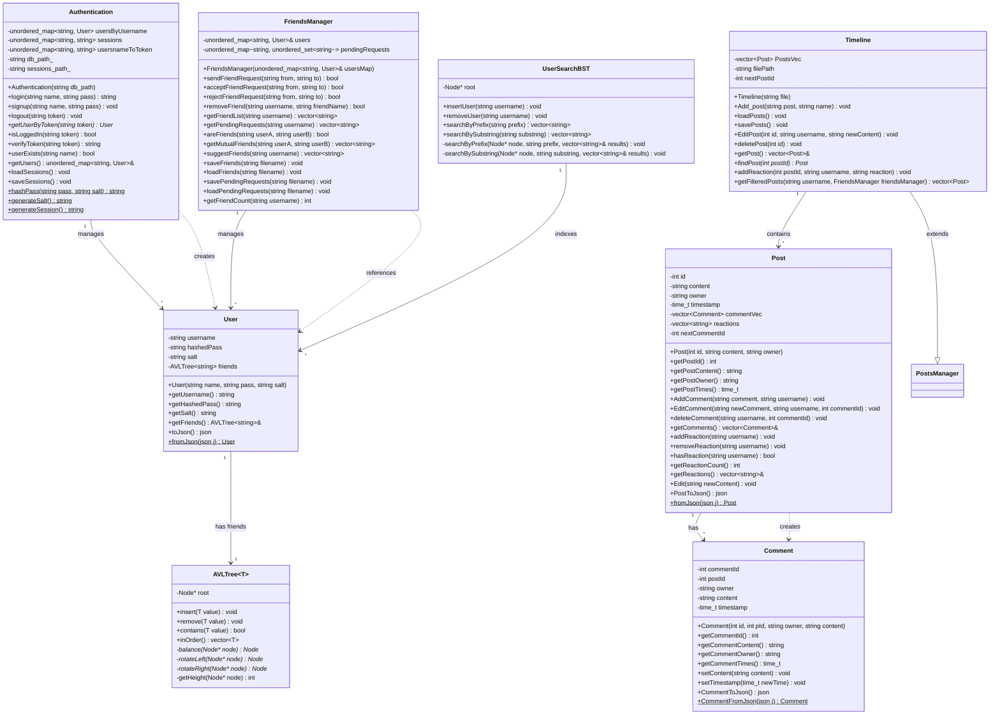

# Social Media Platform UML Documentation

## Class Diagram

## Component Descriptions

### 1. Core User Management
- **Authentication**: Central class for user management and security
- **User**: Represents user entities with their data and friend relationships
- **AVLTree**: Generic balanced tree used for efficient friend list storage

### 2. Social Features
- **FriendsManager**: Handles all friendship-related operations
- **UserSearchBST**: Provides efficient user search functionality
- **Timeline**: Manages the social feed and post organization

### 3. Content Management
- **Post**: Represents social media posts with reactions and comments
- **Comment**: Represents comments on posts
- **Timeline**: Manages post collections and filtering

### 4. Key Relationships
- Authentication manages Users (1-to-many)
- Each User has an AVLTree for friends (1-to-1)
- FriendsManager manages User relationships (1-to-many)
- Timeline contains Posts (1-to-many)
- Posts contain Comments (1-to-many)
- UserSearchBST indexes Users (1-to-many)

### 5. Data Structures
- AVL Tree: For balanced friend list storage
- Binary Search Tree: For efficient user search
- Hash Maps: For user storage and session management
- Vectors: For posts and comments storage

### 6. Features
- Token-based authentication
- Friend request system
- Reaction system
- Comment management
- Post filtering based on friendships
- Efficient user search with prefix and substring matching

### 7. Persistence
- JSON serialization for all data types
- File-based storage for users, posts, friends, and sessions
- Separate files for pending friend requests

## Architecture Benefits
- Efficient data access and manipulation
- Clear separation of concerns
- Scalable social features
- Secure user management
- Persistent data storage
- Optimized search capabilities 